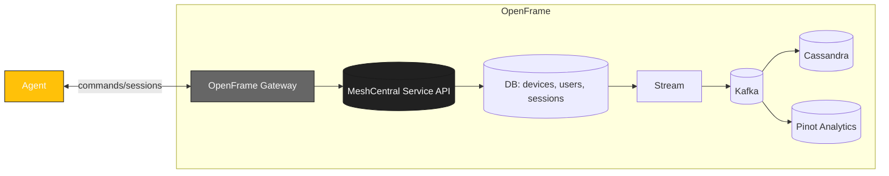

<div align="center">
  <picture>
    <!-- Dark theme -->
    <source media="(prefers-color-scheme: dark)" srcset="https://github.com/flamingo-stack/openframe-oss-tenant/blob/d82f21ba18735dac29eb0f3be5d3edf661bb0060/docs/assets/logo-openframe-full-dark-bg.png">
    <!-- Light theme -->
    <source media="(prefers-color-scheme: light)" srcset="https://github.com/flamingo-stack/openframe-oss-tenant/blob/d82f21ba18735dac29eb0f3be5d3edf661bb0060/docs/assets/logo-openframe-full-light-bg.png">
    <!-- Default / fallback -->
    
  </picture>

  <h1>MeshCentral</h1>

  <p><b>Web-based remote monitoring & management that integrates with OpenFrame — remote desktop, terminal access, file transfer, and device control across Windows, macOS, and Linux.</b></p>

  <p>
    <a href="LICENSE.md">
      
    </a>
    <a href="https://www.flamingo.run/knowledge-base">
      
    </a>
    <a href="https://www.openmsp.ai/">
      
    </a>
  </p>
</div>

---

## Quick Links
- [Highlights](#highlights)
- [Quick Start](#quick-start)
  - [Prerequisites](#prerequisites)
  - [OpenFrame Integration](#openframe-integration)
  - [Architecture](#architecture)
- [Security](#security)
- [Contributing](#contributing)
- [License](#license)  

---

## Highlights

- Remote desktop, terminal, and file management via web interface  
- Cross-platform agent support (Windows, macOS, Linux)  
- Intel AMT support for out-of-band management  
- WebRTC-based peer-to-peer connectivity  
- Multi-user collaboration and session sharing  
- Device grouping and access control policies  
- Extensible with plugins and automation scripts  
- Integrations: OpenFrame Gateway, Stream (Kafka), Analytics (Pinot), Auth (OIDC/JWT)  
- API-first (REST/WebSocket), web console (operator UI)

---

## Quick Start

### Prerequisites

**For OpenFrame Integration:**
- Kubernetes cluster with kubectl
- Telepresence (for local access to services)

---

### OpenFrame Integration

MeshCentral is integrated into OpenFrame for remote device access and management.

---

### Architecture

MeshCentral runs as a service in OpenFrame and connects to endpoint agents via Gateway. Session events flow into Stream and Analytics for monitoring and audit.



#### Deployment

MeshCentral is deployed automatically as part of OpenFrame via ArgoCD app-of-apps pattern:

```yaml
# manifests/apps/values.yaml
apps:
  meshcentral: 
    enabled: true
    project: integrated-tools
    namespace: integrated-tools
    syncWave: "3"  # Deployed after microservices
```

**Access MeshCentral UI:**
```bash
# Connect to integrated-tools namespace
telepresence connect --namespace integrated-tools

# MeshCentral UI will be available at:
# https://meshcentral.integrated-tools.svc.cluster.local:8383
```

**For standalone MeshCentral deployment** (not recommended - registration job will fail):
```bash
helm install meshcentral ./manifests/integrated-tools/meshcentral
```

#### Integration Features

**Auto-initialization:**
- Creates default admin user  
- Sets up device groups and policies
- Generates API keys for integration
- Persists credentials at `/opt/meshcentral/data/credentials.json`
- Registers as integrated tool in OpenFrame

**Configuration** is managed via Helm chart at `manifests/integrated-tools/meshcentral/`.

---

#### Troubleshooting

**Check deployment status:**
```bash
kubectl get pods -n integrated-tools -l app=meshcentral
kubectl logs -f meshcentral-0 -n integrated-tools
```

**Access MeshCentral services via Telepresence:**
```bash
# Connect to cluster
telepresence connect --namespace integrated-tools

# Access MeshCentral UI directly
open https://meshcentral.integrated-tools.svc.cluster.local:8383

# Access MongoDB for debugging
mongo meshcentral-mongodb.integrated-tools.svc.cluster.local/meshcentral
```

**Get API credentials manually:**
```bash
kubectl exec -it meshcentral-0 -n integrated-tools -- \
  cat /opt/meshcentral/data/credentials.json
```

For complete documentation:
- [MeshCentral Official Docs](https://ylianst.github.io/MeshCentral/)
- [MeshCentral User Guide](https://meshcentral.com/docs/MeshCentral2UserGuide.pdf)

## Security

- TLS 1.2 enforced for all communication
- JWT authentication via OpenFrame Gateway
- Role-based access control (RBAC) for users and devices
- Database encryption for secrets
- Support for enrollment secrets or pre-shared keys

Found a vulnerability? Email security@flamingo.run instead of opening a public issue.

## Contributing

We welcome PRs! Please follow these guidelines:  
- Use branching strategy: `feature/...`, `bugfix/...`  
- Add descriptions to the **CHANGELOG**  
- Follow consistent Go code style (`go fmt`, linters)  
- Keep documentation updated in `docs/`  

---

## License

This project is licensed under the **Flamingo Unified License v1.0** ([LICENSE.md](LICENSE.md)).

---

<div align="center">
  <table border="0" cellspacing="0" cellpadding="0">
    <tr>
      <td align="center">
        Built with 💛 by the <a href="https://www.flamingo.run/about"><b>Flamingo</b></a> team
      </td>
      <td align="center">
        <a href="https://www.flamingo.run">Website</a> • 
        <a href="https://www.flamingo.run/knowledge-base">Knowledge Base</a> • 
        <a href="https://www.linkedin.com/showcase/openframemsp/about/">LinkedIn</a> • 
        <a href="https://www.openmsp.ai/">Community</a>
      </td>
    </tr>
  </table>
</div>
